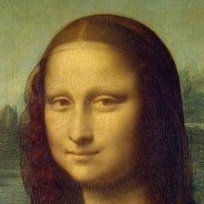

# pytorch iCNN

Reconstructing image/movie from their features in arbitrary CNN model written in pytorch

|                 | Image1                                                       | Image2                                                       |
| --------------- | ------------------------------------------------------------ | ------------------------------------------------------------ |
| Original images |                         |                         |
| feature[0]      | ![recon-image_1-features[0]](image_gallery/image_1/recon-image_1-features[0].jpg) | ![recon-image_2-features[0]](image_gallery/image_2/recon-image_2-features[0].jpg) |
| feature[2]      | ![recon-image_1-features[2]](image_gallery/image_1/recon-image_1-features[2].jpg) | ![recon-image_2-features[2]](image_gallery/image_2/recon-image_2-features[2].jpg) |
| features[10]    | ![recon-image_1-features[10]](image_gallery/image_1/recon-image_1-features[10].jpg) | ![recon-image_2-features[10]](image_gallery/image_2/recon-image_2-features[10].jpg) |
| features[12]    | ![recon-image_1-features[12]](image_gallery/image_1/recon-image_1-features[12].jpg) | ![recon-image_2-features[12]](image_gallery/image_2/recon-image_2-features[12].jpg) |
| features[21]    | ![recon-image_1-features[21]](image_gallery/image_1/recon-image_1-features[21].jpg) | ![recon-image_2-features[21]](image_gallery/image_2/recon-image_2-features[21].jpg) |
| classifier[0]   | ![recon-image_1-classifier[0]](image_gallery/image_1/recon-image_1-classifier[0].jpg) | ![recon-image_2-classifier[0]](image_gallery/image_2/recon-image_2-classifier[0].jpg) |

These images are reconstuctred from the activation (features) of layers in VGG16 trained on ImageNet dataset. You can reconstruct arbitorary images/videos from their features such as AlexNet, ResNet, DenseNet, and other architecture written in pytorch.

## Description 

The basic idea of the algorithm (Mahendran A and Vedaldi A (2015). Understanding deep image representations by inverting them. https://arxiv.org/abs/1412.0035)  is that the image is reconstructed such that the CNN features of the reconstructed image are close to those of the target image. The reconstruction is solved by gradient based optimization algorithm. The optimization starts with a random initial image, inputs the initial image to the CNN model, calculates the error in feature space of the CNN, back-propagates the error to the image layer, and then updates the image.

## Requirements

- Python 3.6 or later
- Numpy 1.19.0
- Scipy 1.5.1
- PIL 7.2.0
- Pytorch 1.5.1
- Torchvison 0.6.1
- Opencv 4.3.0 (if you want to only generate images, you don't need it)

## Usage

The example of reconstructing image is at `example/icnn_shortest_demo.ipynb`.

### Version

version 0.5 #released at 2020/07/13

### Copyright and license

The codes in this repository are based on Inverting CNN (iCNN): image reconstruction from CNN features(https://github.com/KamitaniLab/icnn) which is written for "Caffe" and Python2. These scripts are released under the MIT license.

### Author

Ken Shirakawa

Ph.D. student at Kamitani lab, Kyoto University (http://kamitani-lab.ist.i.kyoto-u.ac.jp)

